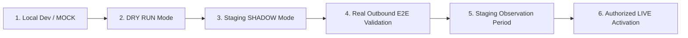

# IncidentFlow — Enterprise Integration Operations Runbook

This document defines the operational lifecycle, safety controls, and stage gates for integrating IncidentFlow with external ServiceNow instances and notification systems.

---

## 1. Automation Lifecycle & Stage Gates

IncidentFlow progresses through strict progressive disclosure stages before any automated write touches an external system of record:

### Stage 1: Development / MOCK
- `SERVICENOW_MOCK=True`
- `EMAIL_PROVIDER=MOCK`
- In-memory mock clients simulate Table API responses.
- Used for rapid unit and local regression testing.

### Stage 2: DRY RUN Mode
- `AUTOMATION_MODE=DRY_RUN`
- Ingests real incident webhooks.
- Computes routing logic (shift, skills, presence, workload).
- Records routing decisions in `AuditLog` as `DRY_RUN`.
- **Zero writes** to ServiceNow or local employee assignments.

### Stage 3: Staging SHADOW Mode
- `AUTOMATION_MODE=SHADOW`
- `SHADOW_MODE=True`
- `LIVE=OFF`
- `EMAIL_PROVIDER=MOCK`
- Real ServiceNow Table API read-only requests.
- Generates full candidate dossiers (Selected candidate, Eligible candidates with workloads, Rejected candidates with rejection reasons).
- Logs `SHADOW_ASSIGN` in IncidentFlow audit logs.
- Displays candidate dossier in Admin Command Center.
- **Strict Invariant**: `SERVICENOW_MUTATION_COUNT=0`. All update calls (`update_incident`, `update_assignment`, `add_work_note`) return `status: "skipped"`.

### Stage 4: Real E2E Verification
- Real non-production ServiceNow staging instance.
- Verified outbound Table API connectivity (`POST /api/admin/integrations/servicenow/test-connection`).
- Verified webhook reception from ServiceNow Business Rule.
- Verified before vs. after state in ServiceNow (`assigned_to` unchanged).
- Replay / duplicate idempotency verified.
- Invalid secret rejection (HTTP 401) verified.

### Stage 5: SMTP Test & Observation
- Validate notifications using `EMAIL_PROVIDER=MOCK`.
- Verify admin preview and dispatch using the Admin "Send Notice" feature (`SEND != ASSIGN`).
- Verify links use dynamic `APP_BASE_URL` rather than hardcoded `localhost:3000`.

### Stage 6: Authorized LIVE Activation
- Requires active Admin role session.
- Requires explicit admin confirmation (`confirmed: true`).
- **Requires exact typed phrase**: `"ENABLE LIVE ASSIGNMENT"`.
- Never activates automatically.

---

## 2. Distinction: Configured vs. Verified

IncidentFlow strictly enforces honesty in operational status reporting:

| Concept | Definition | Criteria |
| :--- | :--- | :--- |
| **CONFIGURED** | Configuration parameters exist in `.env` / environment variables without placeholder tokens. | Environment variable is non-empty and does not contain `<PLACEHOLDER>` or `<...>`. |
| **VERIFIED** | A real, external network round-trip succeeded against the ServiceNow Table API. | HTTP 200 returned from `GET /api/now/table/incident?sysparm_limit=1`, recorded in audit logs with latency and timestamp. |

> [!CAUTION]
> The system **never** reports "Connected" simply because `SERVICENOW_URL` is set in `.env`. If credentials are placeholders or unverified, status displays as `BLOCKED — CREDENTIALS NOT CONFIGURED` or `NOT VERIFIED`.

---

## 3. Webhook Security & Idempotency Controls

1. **Authentication:**
   - Webhook requests must provide the shared secret in either `X-ServiceNow-Secret` or `Authorization: Bearer <secret>`.
   - Unauthorized requests are rejected with **HTTP 401** immediately before processing.
2. **Replay Protection & Idempotency:**
   - Every webhook payload is recorded in `integration_events`.
   - Incidents are indexed and deduplicated by `servicenow_sys_id` and `incident_number`.
   - Duplicate webhook deliveries update mutable fields if changed, but **never** trigger duplicate assignments or duplicate notifications.
3. **Dead Letter Queue (DLQ):**
   - Failed webhook processing or synchronization retries are tracked in `sync_failures`.
   - After exceeding `max_retries` (default 5), records enter `DEAD_LETTER` status.
   - Administrators can inspect errors and trigger manual re-queuing via the Integration Control Center (`/admin/integrations`).

---

## 4. Admin Integration Control Center (`/admin/integrations`)

The Integration Control Center provides a mobile-responsive interface for managing integrations:

- **Connection Status Card**: Displays sanitized hostname, latency (ms), HTTP status, and real-time connectivity code.
- **Webhook Ingestion Card**: Displays events received today, duplicate detections, and rejected payloads.
- **Sync & Recovery Card**: Displays successful syncs, pending retries, failed syncs, and DLQ count.
- **Configuration Checklist**: Interactive checklist tracking `READY` vs. `NOT READY` vs. `BLOCKED`.
- **Read-Only Diagnostics**: Validates Incident table, Assignment Group table, User table, and Field level read permissions without mutating ServiceNow.
- **Live Mode Safety Modal**: Enforces typed confirmation (`"ENABLE LIVE ASSIGNMENT"`) before activating live writes.

---

## 5. Security & Redaction Policies

1. **Zero Secret Exposure:**
   - Passwords, client secrets, webhook secrets, and Authorization headers are never returned via APIs or rendered in the UI.
   - The Webhook Event Inspector (`/admin/integrations/servicenow/events`) automatically redacts fields matching sensitive patterns (`*password*`, `*secret*`, `*token*`, `*auth*`).
2. **Audit Trails:**
   - All connection tests, mode changes, and manual failure retries are logged to `audit_logs` with actor details, timestamps, and request IDs.
